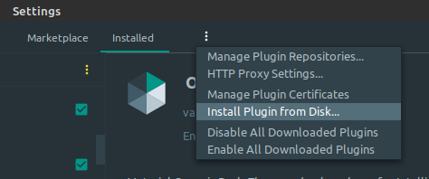
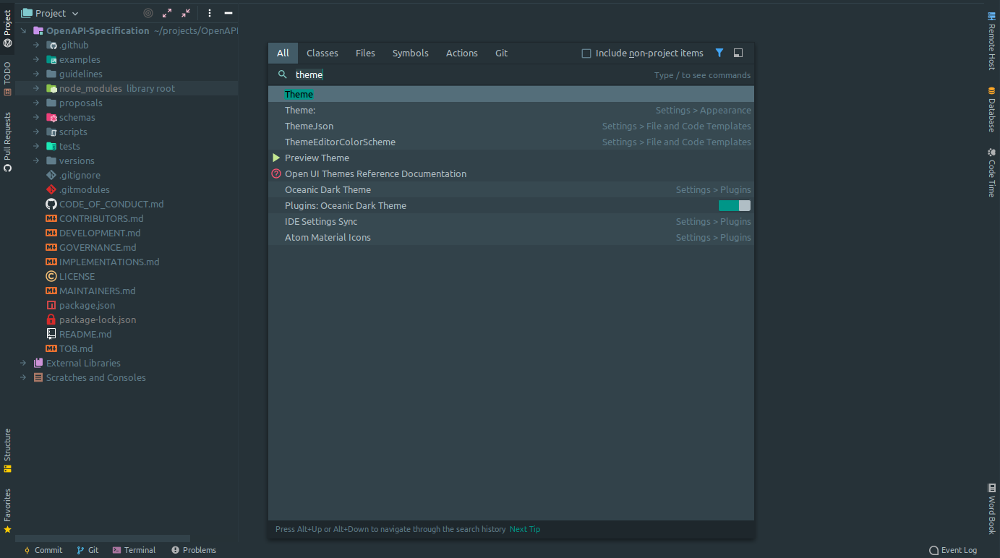
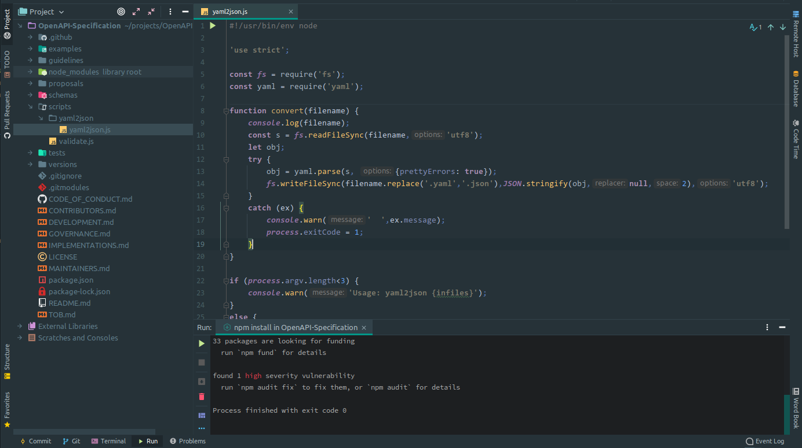
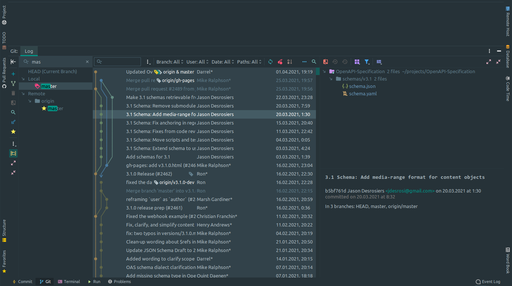
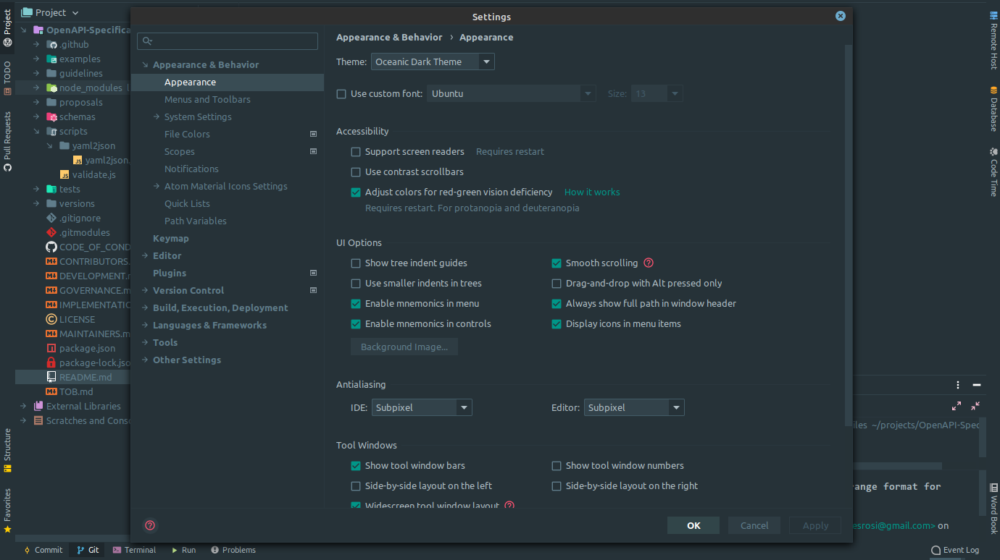

# Oceanic Dark Theme

Material **Oceanic Dark Theme** and **color scheme** for IntelliJ, PHPStorm and other Jetbrains IDEs.

## Installation
1) Open `Preferences -> Plugins -> Marketplace` and search for **`Oceanic Dark Theme`**
2) Install the plugin
3) Click restart your IDE
4) Open `Preferences -> Appearance & Behavior -> Appearance` and select **`Oceanic Dark Theme`** in the theme dropdown.
5) Click Apply and enjoy the theme.

## Manual installation
1) Download the [latest](https://github.com/varrcan/oceanic-dark-theme/releases) version (`oceanic-dark-theme-1.0.*.jar` file)
2) Open the IDE settings and go to Plugins
3) Select from the menu `Install Plugin from Disk`
4) Select `.jar` file and click OK

## Screenshots

Actions

Code

GIT

Settings

## Feedback
Is there anything wrong? Please [open an issue](https://github.com/varrcan/oceanic-dark-theme/issues/new) here on GitHub.
